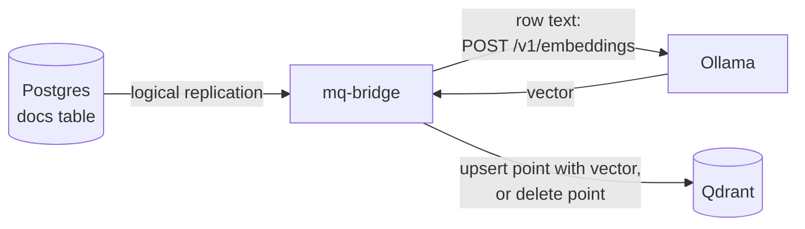

# Postgres CDC → embeddings → Qdrant

Keeps a Qdrant collection in sync with a Postgres table. Existing rows are copied once, then
every insert, update and delete follows through logical replication. Each row's `body` is embedded
by a local [Ollama](https://ollama.com) model (`all-minilm`, 384 dimensions), so no API key is
needed.

Explained in the book: [Keep a vector index in sync with Postgres](https://marcomq.github.io/mq-bridge/use-cases/sync-postgres-to-qdrant.html).



## Run it

Needs Docker, `curl` and `jq`. The first start downloads the embedding model (about 45 MB).

```bash
docker compose up -d
./search.sh "when do I get my money back"
```

`search.sh` prints the three nearest rows with their score. Then change the table and search again:

```bash
docker compose exec postgres psql -U app -d app -c \
  "UPDATE docs SET body = 'Refunds take 10 business days.' WHERE title = 'Refunds'"
docker compose exec postgres psql -U app -d app -c "DELETE FROM docs WHERE title = 'Shipping'"
./search.sh "when do I get my money back"
```

`./test.sh` runs the whole sequence (backfill, insert, update, delete, restart, search) and is what
CI executes. `docker compose down -v` removes everything.

`TRUNCATE docs` is not synchronized: the publication in `init.sql` publishes inserts, updates and
deletes only, so the points stay in Qdrant until you delete them or recreate the collection.

## Files

| File | Purpose |
| :--- | :--- |
| [`routes.yaml`](routes.yaml) | The route: `postgres_cdc` input, `lookup` to the embeddings API, `http_bulk` output to Qdrant |
| [`docker-compose.yml`](docker-compose.yml) | Postgres 16, Qdrant 1.19.0, Ollama 0.12.3, mq-bridge-app 0.4.18 |
| [`init.sql`](init.sql) | The `docs` table, its publication and three rows |
| [`search.sh`](search.sh) | Embeds a query and asks Qdrant for the nearest points |

## Use another embeddings API

The `lookup` middleware posts `{"model": ..., "input": ...}` to `/v1/embeddings` and reads
`data[0].embedding`, the request and response shape of the OpenAI embeddings API. To call a hosted
API, change the `http` URL in `routes.yaml`, set the model name, add the provider's authorization
header to the `http` endpoint, and create the collection with that model's vector size.
